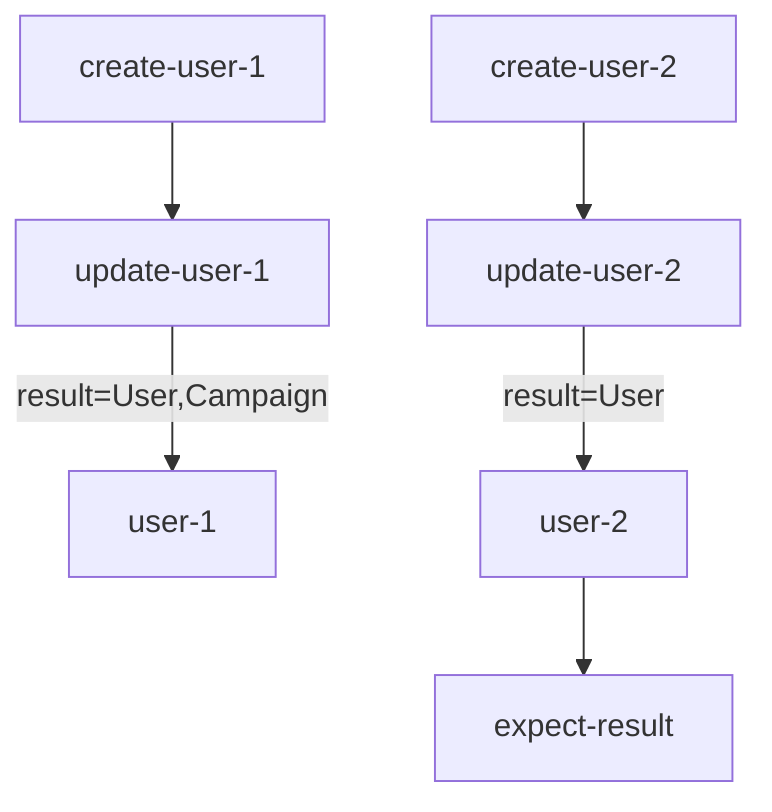
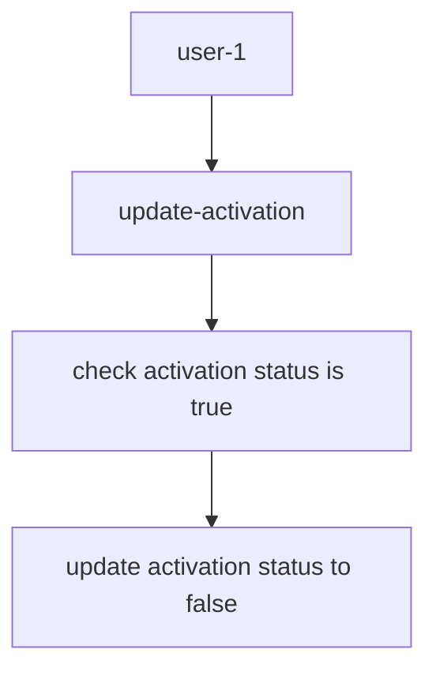

## test case-2

```mermaid
flowchart TD
    create-user-1
        --> update-user-1 --result=User,Campaign
        --> user-1

    create-user-2
        --> update-user-2
        --result=User
        --> user-2
        --> expect-result
```

## it should register a user with `username` and `password`

```mermaid
flowchart TD
    user-1
        --> update-activation
        --> check-activation[check activation status is true]
        --> update-activation-2[update activation status to false]

```
